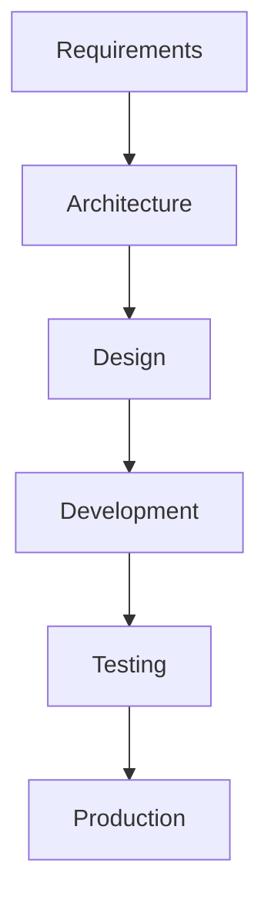

# 🏗 Systems Engineering (MBSE)

This section explains the purpose of each free Systems Engineering and modeling tool, when to use it, and how they work together in an engineering organization.

---

# Which Tool Should I Choose?

| Tool | Best For | Primary Purpose |
|------|----------|-----------------|
| ⭐ Capella | Complete System Engineering | MBSE, Architecture, Requirements Traceability |
| Eclipse Papyrus | SysML/UML Modeling | Standard SysML & UML diagrams |
| Modelio | UML + SysML | Lightweight system/software modeling |
| PlantUML | Diagram as Code | Automatic UML generation from text |
| Mermaid | Documentation | Diagrams inside Markdown and GitHub README |

---

# 1. Capella ⭐

## Purpose

Capella is a **Model-Based Systems Engineering (MBSE)** tool.

It is used to design **the entire system**, not just software.

Capella follows the **Arcadia** engineering methodology.

---

## Main Features

- ✅ Operational Analysis
- ✅ Stakeholder Analysis
- ✅ Functional Analysis
- ✅ System Analysis
- ✅ Logical Architecture
- ✅ Physical Architecture
- ✅ Interface Definition
- ✅ Requirements Traceability
- ✅ Data Flow Modeling
- ✅ Component Allocation

---

## Example Use Case

Project:

```
Electric Glass Transloader
```

Capella models:

```
Customer Needs
        │
        ▼
Operational Analysis
        │
        ▼
System Functions
        │
        ▼
Logical Components
        │
        ▼
Physical Components
        │
        ▼
Verification
```

Example Components

```
Glass Transloader

├── Battery
├── BMS
├── Motor
├── Inverter
├── Hydraulic Pump
├── PLC
├── HMI
├── AI Camera
├── CAN Network
└── Safety System
```

Everything and every interface can be connected in one model.

---

## Best For

- EV Development
- Robotics
- Aerospace
- Industrial Machines
- Rail
- Defense
- Complex Products

---

# 2. Eclipse Papyrus

## Purpose

Papyrus is an open-source modeling tool that supports the official **SysML** and **UML** standards.

Unlike Capella, Papyrus does **not** provide an engineering methodology (such as Arcadia). It is primarily used to create standards-compliant models.

---

## Main Features

- ✅ SysML
- ✅ UML
- ✅ Requirement Diagrams
- ✅ Block Definition Diagrams
- ✅ Internal Block Diagrams
- ✅ Sequence Diagrams
- ✅ Activity Diagrams
- ✅ State Machines
- ✅ Parametric Diagrams

---

## Example Use Case

Designing the architecture of a Battery Management System (BMS):

```
Battery Pack
      │
      ▼
BMS Controller
      │
      ▼
CAN Network
      │
      ▼
Vehicle Controller
```

---

## Best For

- SysML Learning
- Academic Projects
- Standard-Compliant Models
- Systems Architecture

---

# 3. Modelio

## Purpose

Modelio is a lightweight UML and SysML modeling tool.

It is easier to learn than Papyrus and is well suited for small and medium-sized projects.

---

## Main Features

- ✅ UML
- ✅ SysML
- ✅ Class Diagrams
- ✅ Sequence Diagrams
- ✅ State Machines
- ✅ Activity Diagrams
- ✅ Use Cases
- ✅ Requirement Modeling

---

## Example Use Case

Software Architecture

```
Vehicle Controller

├── CAN Manager
├── PWM Driver
├── Diagnostics
├── Motor Control
└── Safety Monitor
```

---

## Best For

- Software Architecture
- Small Engineering Teams
- Embedded Projects
- UML Learning

---

# 4. PlantUML

## Purpose

PlantUML creates diagrams from plain text.

Instead of drawing boxes manually, you write code and PlantUML generates the diagram automatically.

This makes diagrams easy to version-control using Git.

---

## Main Features

- ✅ UML as Code
- ✅ Sequence Diagrams
- ✅ Class Diagrams
- ✅ Component Diagrams
- ✅ Deployment Diagrams
- ✅ State Machines
- ✅ Automatic Diagram Generation

---

## Example

PlantUML source:

```text
@startuml

Controller --> Motor
Controller --> Battery
Controller --> HMI

@enduml
```

Generated Diagram

```
Controller

├── Motor
├── Battery
└── HMI
```

---

## Best For

- GitHub Projects
- Software Documentation
- CI/CD Documentation
- Automatic Diagram Generation

---

# 5. Mermaid

## Purpose

Mermaid is a lightweight diagram language supported directly by GitHub Markdown.

No external software is required to display diagrams on GitHub.

---

## Main Features

- ✅ Flowcharts
- ✅ Sequence Diagrams
- ✅ State Diagrams
- ✅ Entity Relationship Diagrams
- ✅ Gantt Charts
- ✅ Mind Maps
- ✅ User Journey Diagrams

---

## Example



Displays as

```
Requirements

↓

Architecture

↓

Design

↓

Development

↓

Testing

↓

Production
```

---

## Best For

- GitHub README
- Technical Documentation
- Project Documentation
- Engineering Wikis

---

# Feature Comparison

| Feature | Capella | Papyrus | Modelio | PlantUML | Mermaid |
|----------|:-------:|:--------:|:--------:|:---------:|:--------:|
| MBSE | ✅ | ⭐ | ❌ | ❌ | ❌ |
| SysML | ⭐ | ✅ | ✅ | Partial | ❌ |
| UML | ⭐ | ✅ | ✅ | ✅ | Limited |
| Requirements | ✅ | ✅ | ⭐ | ❌ | ❌ |
| Functional Architecture | ✅ | ⭐ | ❌ | ❌ | ❌ |
| Logical Architecture | ✅ | ⭐ | ❌ | ❌ | ❌ |
| Physical Architecture | ✅ | ⭐ | ❌ | ❌ | ❌ |
| Interface Modeling | ✅ | ⭐ | ❌ | ❌ | ❌ |
| Diagram as Code | ❌ | ❌ | ❌ | ✅ | ✅ |
| GitHub Friendly | ⭐ | ⭐ | ⭐ | ✅ | ✅ |
| Learning Curve | High | High | Medium | Low | Very Low |

---

# Typical Workflow

```
Customer Requirements
        │
        ▼
      Capella
(System Architecture)
        │
        ▼
Papyrus / Modelio
(Detailed SysML/UML Models)
        │
        ▼
PlantUML
(Software Design Documentation)
        │
        ▼
Mermaid
(Project Documentation & README)
```

---

# Recommended Usage

| Situation | Recommended Tool |
|-----------|------------------|
| Complete Systems Engineering | ⭐ Capella |
| Learn or Practice SysML | ⭐ Eclipse Papyrus |
| Small UML/SysML Projects | ⭐ Modelio |
| Version-Controlled UML | ⭐ PlantUML |
| GitHub README Documentation | ⭐ Mermaid |

---

# Recommended Stack

✅ Capella → System Architecture (MBSE)

✅ Eclipse Papyrus → Detailed SysML Models

✅ Modelio → Lightweight UML/SysML

✅ PlantUML → UML as Code

✅ Mermaid → README & Documentation Diagrams

---

## Final Recommendation

For an **EV, Robotics, or Industrial Vehicle company**, the tools complement each other rather than compete:

- **Capella** defines the **overall system architecture**.
- **Papyrus** refines architecture using standard **SysML**.
- **Modelio** is useful for **smaller modeling tasks**.
- **PlantUML** keeps software architecture diagrams version-controlled with your source code.
- **Mermaid** documents workflows, processes, and architectures directly in GitHub READMEs.
